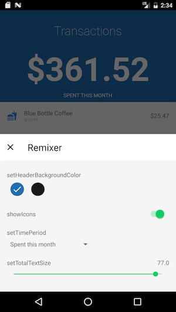

#  Remixer Android

  

Remixer is a framework to iterate quickly on UI changes by allowing you to adjust UI variables without needing to rebuild (or even restart) your app. You can adjust Numbers, Colors, Booleans, and Strings. To see it in action check out the [example app](https://github.com/material-foundation/material-remixer-android/tree/develop/remixer_example).

If you are interested in using Remixer in another platform, you may want to check out the [iOS](https://github.com/material-foundation/material-remixer-ios) and [Javascript](https://github.com/material-foundation/material-remixer-js) repos. With any of the three platforms you can use the [Remote Controller](https://github.com/material-foundation/material-remixer-remote-web).

## Using Remixer in your app

The following docs explain how to get Remixer up and running in your app, and details on what Variable types are currently supported.

- [Using Remixer](docs/USING_REMIXER.md)
- [Configure the UI](docs/CONFIGURE_UI.md)
- [Supported Data Types](docs/SUPPORTED_DATA_TYPES.md)
- (Optionally) [Configure the Firebase Remote Controller](docs/CONFIGURE_FIREBASE.md)

## Contributing to Remixer

We're excited you want to contribute to the project! Please read these docs so we can get your contributions submitted quickly.

- [Contribution policy and guidelines](docs/CONTRIBUTING.md)
- [Project structure](docs/PROJECT_STRUCTURE.md)
- [Extending Remixer](docs/EXTENDING_REMIXER.md)

## API Reference

_Notice this includes internal APIs_:

- [Current Version 1.0](https://jitpack.io/com/github/material-foundation/material-remixer-android/remixer/1.0/javadoc/index.html)
- [Develop Snapshot](https://jitpack.io/com/github/material-foundation/material-remixer-android/remixer/develop-SNAPSHOT/javadoc/index.html)

## Is material-foundation affiliated with Google?

Yes, the [material-foundation](https://github.com/material-foundation) organization is one of Google's new homes for tools and frameworks related to our [Material Design](https://material.io) system. Please check out our blog post [Design is Never Done](https://design.google.com/articles/design-is-never-done/) for more information regarding Material Design and how Remixer integrates with the system.

## License

© Google, 2016. Licensed under an [Apache-2](https://github.com/material-foundation/material-remixer-android/blob/develop/LICENSE) license.
