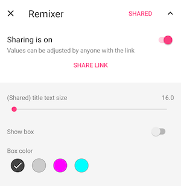

# Configuring the Firebase Remote Controller

There are three steps to being able to use the Firebase Remote Controller with Remixer for Android:

1. Install the Firebase Remote Controller on a Firebase Instance.
2. Get your Firebase credentials
3. Set up Remixer synchronization to use the Firebase Remote.

## Step 1: Install Remote Controller on Firebase

This is out of the scope of this document, as it is properly documented [in the remote's repo](https://www.github.com/material-foundation/material-remixer-remote-web).

## Step 2: Get your Firebase credentials

- Go to your [Firebase console](https://console.firebase.google.com) and click on the Firebase App where you have uploaded the Remixer Remote Controller.
- Click _Add another app_ and follow the instructions (you can reuse an already registered app if that is appropriate).
- At the end you'll download a `google-services.json` file. Put that next to your application module's `build.gradle`

More detail can be found in [the Firebase documentation](https://firebase.google.com/docs/android/setup#manually_add_firebase).

## Step 3: Set up Remixer synchronization

Remixer relies on implementations of `SynchronizationMechanism` to store and sync values. This is set on your Application class's `onCreate()` method.

In order to use the Remote you only need to use the correct SynchronizationMechanism, `FirebaseRemoteControllerSyncer`, and optionally force it to start sharing variable status immediately

```java
import android.app.Application;
import com.google.android.libraries.remixer.Remixer;
import com.google.android.libraries.remixer.storage.FirebaseRemoteControllerSyncer;
import com.google.android.libraries.remixer.ui.RemixerInitialization;

class MyApplication extends Application {
  @Override
  public void onCreate() {
    super.onCreate();
    RemixerInitialization.initRemixer(this);
    FirebaseRemoteControllerSyncer syncer = new FirebaseRemoteControllerSyncer(this);
    Remixer.getInstance().setSynchronizationMechanism(syncer);
    // Optionally you can start sharing your variables to the Remote automatically.
    syncer.startSharing();
  }
}
```

Since all the Variable Adjustment UI is completely available in the Firebase Remote Controller, if you start sharing in the Application class you may not want/need to use the `RemixerFragment` at all. In that case you can use `FirebaseRemoteControllerSyncer#getShareLinkIntent()` or `FirebaseRemoteControllerSyncer#getRemoteUrl()` to direct users to the remote on your own terms.

Otherwise, the `RemixerFragment` will automatically show options to share variables with the remote controller and share the link, see below:


